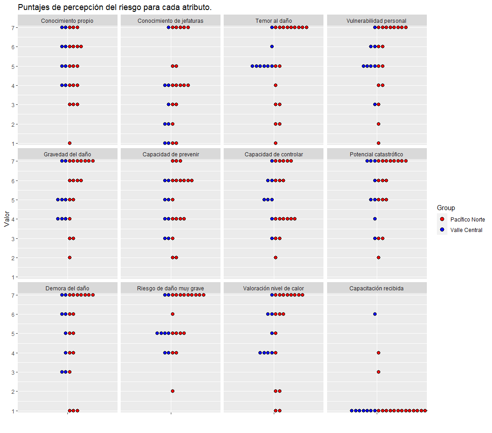
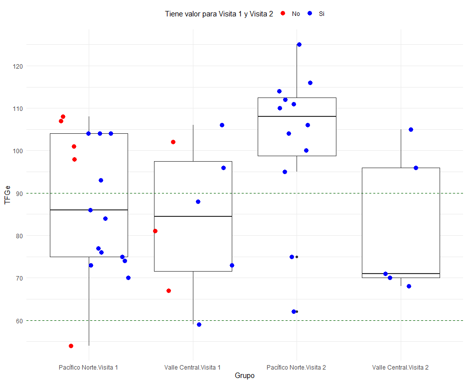

## 🌡️ Project Overview

This collaborative project supported a master’s thesis studying the impact of **heat exposure** on hydration and kidney function among road construction workers in **Costa Rica**. Field data was collected across **two visits** in **two distinct regions**: _Valle Central_ and _Pacífico Norte_.

I handled the **entire analytics pipeline**: from data cleaning and reshaping, to statistical testing and high-quality visualizations.

---

## 🧰 Tools & Skills Applied

- **R & RStudio**, using packages like `ggplot2`, `tidyverse`, `janitor`, and `gtsummary`
- Data preprocessing, ID anonymization, and multi-source merging
- Statistical testing: Fisher’s Exact Test, Wilcoxon, Kruskal-Wallis
- Complex `ggplot2` visualizations for biometrics and time series
- Automated R scripts to generate reproducible results

---

## 🔍 Key Findings

- **Creatinina levels** showed a significant increase in Pacífico Norte from Visit 1 to Visit 2  
- **USG readings** indicated higher dehydration risk in Pacífico Norte  
- **Heart rate trends** revealed physically intense labor sustained over long hours, especially for peones  
- **TFGe** was more stable in Valle Central across visits

---

## 📈 Sample Visualizations

### 🧪 Creatinine by Region and Visit

---

### 🫀 Heart Rate Pattern (Peón Role)

---

### 📦 TFGe Distribution Across Visits

---

## ⚖️ Statistical Summary (Examples)

| Test | Metric | Result |
|------|--------|--------|
| USG (Visit 1) | Kruskal-Wallis | p = 0.086 |
| Creatinina (Visit 2) | Wilcoxon | p = 0.017 |
| TFGe (Visit 2) | t-test | p = 0.059 |
| Heart Rate (Peones) | Mean Comparison | elevated sustained bpm |

---

## 🤝 My Role

- Managed and cleaned over 1,000 lines of R code  
- Built out all final ggplot2 visualizations for the thesis  
- Performed all non-parametric and parametric tests  
- Collaborated on variable selection, but led all technical execution  
- Drafted summary interpretation text and advised on visual clarity

---

## 🚀 Ongoing Work

I’m currently building an **interactive Shiny dashboard** for this project to visualize hydration, renal metrics, and real-time heart rate monitoring across visits and roles.

---

## 💬 Want to Collaborate?

If you're looking for help with **biomedical data**, **public health analytics**, or **advanced visual reporting in R**, feel free to [get in touch](/contact/).
